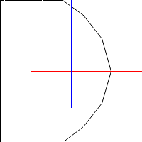

# Kepler Orbits
I was testing out this idea as part of a possible physics engine. The benefits are that the position of an object is deterministic and has a time complexity of O(1). The downsides are that the calculations to determine orbital anomalies are complex. Additionally, orbital anomalies are angles so positions near the apoapsis are less precise than at the periapsis. This is especially true for hyperbolic orbits.

